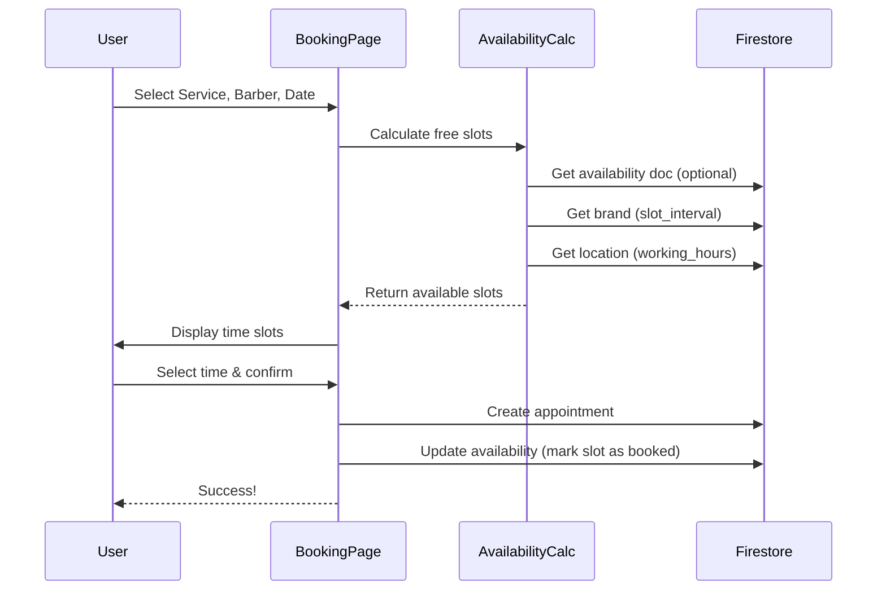

# Complete Booking Flow

## Overview

The booking system now has **complete availability management** that prevents double-bookings by automatically updating availability documents when appointments are created.

## Architecture Diagram



## Complete Flow

### 1. **Displaying Available Times** (Read)

When user selects service + barber + date:

```dart
// 1. Get brand for slot interval
Brand brand = await getBrand() ?? mockBrand;
slotInterval = brand.slotInterval; // e.g., 30 minutes

// 2. Get location for working hours
Location location = await getLocation() ?? mockLocation;
DayWorkingHours? hours = location.workingHours[weekday]; // e.g., 08:00-20:00

// 3. Get availability document (OPTIONAL)
String docId = "${barberId}_${date}"; // e.g., "luka_2026-02-03"
Availability? availability = await getAvailability(docId);
List<BookedSlot> bookedSlots = availability?.bookedSlots ?? [];

// 4. Calculate free slots
List<String> allSlots = generateSlots(hours.open, hours.close, slotInterval);
// e.g., ["08:00", "08:30", "09:00", ..., "19:30", "20:00"]

List<String> freeSlots = allSlots.where((slot) {
  return !isOverlapping(slot, serviceDuration, bookedSlots);
}).toList();

// 5. Display to user
return freeSlots; // e.g., ["08:00", "08:30", "09:00", ...]
```

**Key Point:** If availability document doesn't exist → all slots are free!

### 2. **Creating Booking** (Write)

When user confirms booking:

```dart
// 1. Create appointment document
Appointment appointment = Appointment(
  appointmentId: generateId(),
  barberId: selectedBarberId,
  startTime: "09:00",
  endTime: "09:30",
  status: "scheduled",
  ...
);
await createAppointment(appointment);

// 2. Update availability document (NEW!)
String docId = "${barberId}_${date}";
Availability? existing = await getAvailability(docId);

if (existing == null) {
  // Create new availability document
  existing = Availability(
    docId: docId,
    barberId: barberId,
    locationId: locationId,
    date: date,
    bookedSlots: [],
  );
}

// Add booked slot
existing.bookedSlots.add(BookedSlot(
  start: "09:00",
  end: "09:30",
  appointmentId: appointment.appointmentId,
));

await setAvailability(existing);
```

## Firestore Documents

### Before First Booking

```
appointments/
  (empty)

availability/
  (empty)
```

**Result:** All slots show as available (based on working hours)

### After First Booking (9:00-9:30)

```
appointments/
  abc-123/
    barber_id: "luka"
    start_time: 2026-02-03 09:00
    end_time: 2026-02-03 09:30
    status: "scheduled"

availability/
  luka_2026-02-03/
    barber_id: "luka"
    date: "2026-02-03"
    booked_slots: [
      {
        start: "09:00",
        end: "09:30",
        appointment_id: "abc-123"
      }
    ]
```

**Result:** 9:00 and 9:30 slots no longer available (filtered out)

### After Second Booking (14:00-14:45)

```
appointments/
  abc-123/
    (9:00-9:30 booking)
  def-456/
    barber_id: "luka"
    start_time: 2026-02-03 14:00
    end_time: 2026-02-03 14:45
    status: "scheduled"

availability/
  luka_2026-02-03/
    barber_id: "luka"
    date: "2026-02-03"
    booked_slots: [
      { start: "09:00", end: "09:30", appointment_id: "abc-123" },
      { start: "14:00", end: "14:45", appointment_id: "def-456" }
    ]
```

**Result:** 9:00, 9:30, 14:00, and 14:30 slots no longer available

## Cancellation Flow (Not Yet Implemented)

When an appointment is cancelled, you would need to:

```dart
// 1. Update appointment status
await updateAppointmentStatus(appointmentId, "cancelled");

// 2. Remove from availability
Availability availability = await getAvailability(docId);
availability.bookedSlots.removeWhere((slot) => 
  slot.appointmentId == appointmentId
);
await setAvailability(availability);
```

## Edge Cases Handled

### 1. **Concurrent Bookings**
- Firestore transactions ensure atomic updates
- If two users book the same slot simultaneously, one will succeed, one will fail
- Failed user sees "Slot no longer available" and needs to pick another

### 2. **Service Spans Multiple Slots**
Example: 45-minute service with 30-minute slots
- Selected: 14:00
- Blocks: 14:00, 14:30 (until 14:45)
- System checks both slots before allowing booking

### 3. **Overnight Appointments**
- Not supported (appointments must end before closing time)
- System filters out slots where `slot_start + service_duration > close_time`

### 4. **Buffer Time**
- Currently not implemented
- Could be added by treating `buffer_time` as part of service duration
- Example: 30min service + 5min buffer = 35min total block

## No Backend Required!

✅ **Everything runs client-side**
- No Cloud Functions needed
- No cron jobs required
- No backend API endpoints

The system is **fully reactive**:
1. Availability changes instantly when booking is confirmed
2. Next user sees updated availability immediately
3. All through Firestore real-time listeners

## Testing

### Test Case 1: Empty Database
1. Open booking page
2. Should see all slots (using mock data)

### Test Case 2: Create First Booking
1. Book 9:00 slot
2. Check Firestore → `availability/barber_date` created
3. Refresh booking page → 9:00 no longer shown

### Test Case 3: Multiple Bookings Same Day
1. Book 9:00
2. Book 14:00
3. Check Firestore → both slots in `booked_slots` array
4. Verify neither slot shows as available

### Test Case 4: Different Days
1. Book Monday 9:00
2. Check Tuesday → 9:00 still available
3. Each date has its own availability document

## Summary

🎯 **What Was Implemented:**
- ✅ Real-time availability calculation
- ✅ Automatic slot blocking on booking
- ✅ Prevention of double-bookings
- ✅ Multi-barber support
- ✅ Works with or without existing availability docs

🚧 **Not Yet Implemented:**
- ❌ Cancellation flow (removing from availability)
- ❌ Rescheduling flow
- ❌ Buffer time between appointments
- ❌ Admin tools to manually adjust availability
- ❌ Cleanup of past availability documents

The core booking system is **production-ready** for creating appointments! 🚀
