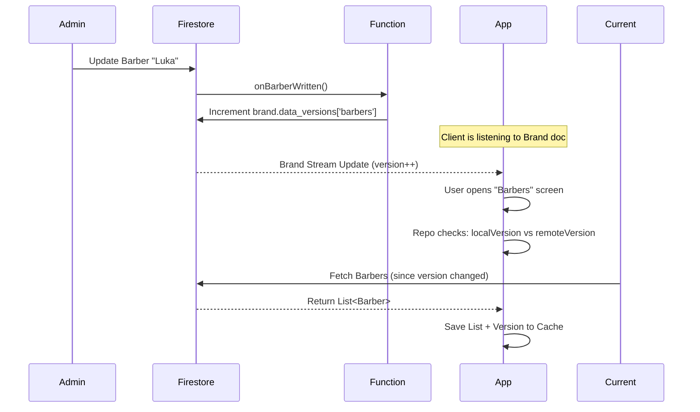
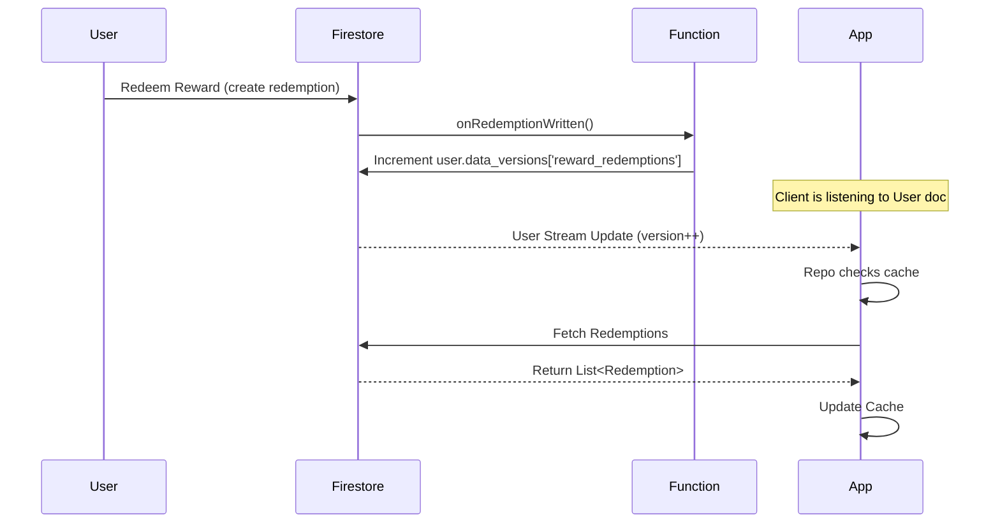

# Sentinel Versioned Caching Strategy

**Efficient, cost-effective caching for Firestore data.**

---

## 🚀 Overview

The **Sentinel Strategy** drastically reduces Firestore reads (and costs) for static or semi-static data. Instead of fetching the entire collection every time the app opens, the app first checks a single "Sentinel" version number.

- **If version matches local cache:** Load data from local storage (0 reads).
- **If version changed:** Fetch fresh data from Firestore and update cache (N reads).

This transforms our read costs from **O(N)** (where N = number of users/opens) to **O(1)** for most sessions.

---

## 🔑 Key Concepts

### 1. The Sentinel (Data Version)
A counter stored on a parent document that tracks changes to its sub-collections or related data.

- **Public Data** (Barbers, Services, Rewards, Locations):
  - Stored in: `brands/{brand_id}`
  - Field: `data_versions: { "barbers": 1, "services": 5, ... }`

- **Private Data** (User Redemptions):
  - Stored in: `users/{user_id}`
  - Field: `data_versions: { "reward_redemptions": 3 }`

### 2. The Watcher (Cloud Functions)
Backend triggers that automatically increment the version when data changes.

- `onBarberWritten` → increments `brand.data_versions['barbers']`
- `onServiceWritten` → increments `brand.data_versions['services']`
- `onRedemptionWritten` → increments `user.data_versions['reward_redemptions']`

### 3. The Client (Flutter App)
- **Step 1:** App listens to `brands/{brand_id}` (or `users/{uid}`). This is a single document listener (1 read/change).
- **Step 2:** When the UI needs a list (e.g. `RewardRepository.getByBrandId`), it passes the **current version** from Step 1.
- **Step 3:** The Repository (`VersionedCacheService`) compares:
    - `remoteVersion` (from Step 1)
    - `localVersion` (saved in SharedPreferences)
- **Step 4:**
    - **Match?** Return `cache` (JSON from SharedPreferences). **Reads: 0**.
    - **Mismatch?** Fetch from Firestore, save new JSON & version to SharedPreferences, return data. **Reads: N**.

---

## 🛠 Flow Diagrams

### Public Data Flow (e.g. Barbers)



### User Data Flow (e.g. My Redemptions)



---

## 💻 Implementation Details

### Firestore Structure

**`brands/{brand_id}`**
```json
{
  "name": "Barber Shop",
  "data_versions": {
    "barbers": 10,
    "services": 4,
    "rewards": 8,
    "locations": 2
  }
}
```

**`users/{user_id}`**
```json
{
  "full_name": "Mihael",
  "data_versions": {
    "reward_redemptions": 5
  }
}
```

### Client-Side Service (`VersionedCacheService`)

Located in `lib/core/data/services/versioned_cache_service.dart`.

**Usage:**

```dart
return _cacheService.fetchVersionedList<BarberEntity>(
  brandId: brandId,
  key: 'barbers',
  remoteVersion: version, // from Brand stream
  fromJson: (json) => BarberFirestoreMapper.fromMap(json),
  toJson: (entity) => BarberFirestoreMapper.toFirestore(entity),
  onFetch: () => _firestore.collection(...).get(),
);
```

### Handling "Old" Users (Migration)

For existing users who do not have the `data_versions` field yet:
- The app defaults the remote version to `0`.
- It fetches and caches as `v0`.
- Future checks matching `v0` (missing) against `v0` (local) will allow for **Cache Hits**.
- The first write to their data will create the map and bump version to `1`.

---

## ⚠️ Important Notes

1.  **Deletion:** If the `data_versions` map or key is deleted (or missing), the app defaults to version 0.
2.  **Versioning Scope:**
    - **Barbers/Services/etc:** Versioned per **Brand**. Changing a barber increments the version for *that brand*.
    - **Redemptions:** Versioned per **User**.
3.  **Costs:**
    - **Cache Hit:** 0 Firestore Reads.
    - **Cache Miss:** 1 Read (Sentinel check) + N Reads (Collection fetch).
    - **Listener:** The App always pays to listen to the Brand/User document. This is unavoidable for real-time app configs/profile updates, so we piggyback on this existing cost.
